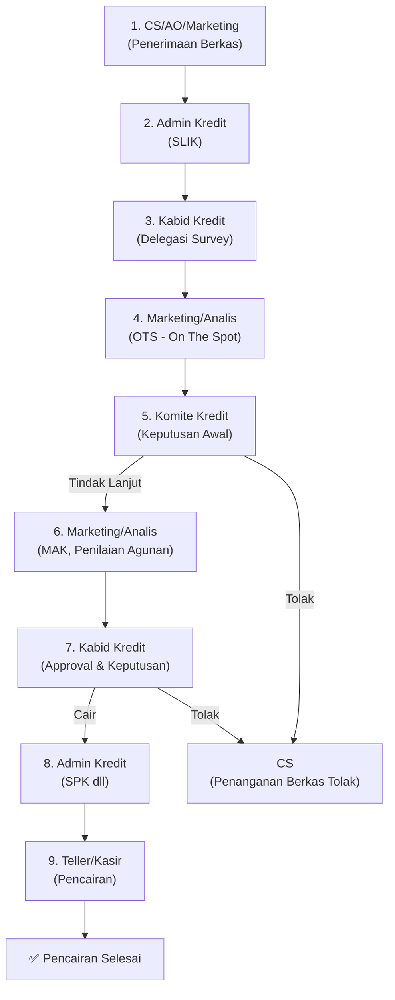

# Rencana Implementasi: Monitoring Berkas Pengajuan Kredit v2

> **Tujuan**: Memperbarui pipeline kredit dari 4 tahap menjadi **10 tahap** sesuai diagram alur resmi perusahaan.

---

## 1. Gap Analysis: Implementasi Saat Ini vs Diagram Alur Sebenarnya

### Diagram Alur Resmi (10 Tahap)



### Perbandingan Implementasi

| # | Tahap Diagram | Stage di Sistem Saat Ini | Status |
|---|---|---|---|
| 1 | CS/AO/Marketing (Penerimaan) | `penerimaan` | ✅ Ada |
| 2 | Admin Kredit (SLIK) | ❌ Tidak ada | 🔴 Perlu ditambah |
| 3 | Kabid Kredit (Delegasi Survey) | ❌ Tidak ada | 🔴 Perlu ditambah |
| 4 | Marketing/Analis (OTS) | `analisa` (parsial) | 🟡 Perlu dipecah |
| 5 | Komite Kredit (Keputusan) | ❌ Tidak ada | 🔴 Perlu ditambah |
| 6 | Marketing/Analis (MAK, Agunan) | ❌ Tidak ada | 🔴 Perlu ditambah |
| 7 | Dirut / Kabid Kredit (Approval) | `verifikasi` (parsial) | 🟡 Perlu disesuaikan |
| 8 | Keputusan Kredit | ❌ Tidak ada | 🔴 Perlu ditambah |
| 9 | Admin Kredit (SPK) | `admin_pencairan` (parsial) | 🟡 Perlu disesuaikan |
| 10 | Teller/Kasir (Pencairan) | ❌ Tidak ada | 🔴 Perlu ditambah |

### Alur Tolak (Branching)
- **Tahap 5 (Komite Kredit) → TOLAK** → Kembali ke CS (penanganan berkas)
- **Tahap 8 (Keputusan Kredit) → TOLAK** → Kembali ke CS (penanganan berkas)

> [!IMPORTANT]
> Saat ini sistem hanya punya 4 stage linear. Diagram menunjukkan **10 tahap** dengan **2 titik keputusan** yang bisa menolak/mengembalikan berkas ke CS.

---

## 2. Definisi Stage Baru (Backend)

### KreditStage Type (Baru)

```typescript
export type KreditStage = 
  | 'penerimaan'         // 1. CS/AO/Marketing - Terima berkas awal
  | 'slik'               // 2. Admin Kredit - Pengecekan SLIK/iDEB
  | 'delegasi_survey'    // 3. Kabid Kredit - Delegasikan surveyor
  | 'ots'                // 4. Marketing/Analis - On The Spot survey
  | 'komite_kredit'      // 5. Komite Kredit - Rapat keputusan awal
  | 'mak_agunan'         // 6. Marketing/Analis - MAK + penilaian agunan
  | 'approval_pimpinan'  // 7. Dirut/Kabid - Persetujuan final
  | 'keputusan_kredit'   // 8. Keputusan final (cair/tolak)
  | 'admin_spk'          // 9. Admin Kredit - SPK dll
  | 'pencairan'          // 10. Teller/Kasir - Proses pencairan
  | 'selesai'            // Terminal: pencairan selesai
  | 'ditolak_cs';        // Terminal: dikembalikan ke CS untuk penanganan
```

### Mapping Stage → Jabatan

| Stage | Jabatan yang Memproses | Position Keywords |
|-------|----------------------|-------------------|
| `penerimaan` | Customer Service | `cs`, `customer service` |
| `slik` | Kasubid Admin Kredit | `adminitrasi`, `adm kredit` |
| `delegasi_survey` | KABID Kredit | `kabid kredit` |
| `ots` | Marketing / Analis | `marketing`, `analis` |
| `komite_kredit` | KABID Kredit (ketua komite) | `kabid kredit` |
| `mak_agunan` | Marketing / Analis | `marketing`, `analis` |
| `approval_keputusan` | KABID Kredit | `kabid kredit` |
| `admin_spk` | Kasubid Admin Kredit | `adminitrasi`, `adm kredit` |
| `pencairan` | Teller / Kasir | `teller`, `kasir` |

### Transisi Stage (Next Stage Map)

```typescript
const STAGE_FLOW: Record<KreditStage, KreditStage | null> = {
  'penerimaan': 'slik',
  'slik': 'delegasi_survey',
  'delegasi_survey': 'ots',
  'ots': 'komite_kredit',
  'komite_kredit': 'mak_agunan',      // Jika "tindak lanjut"
  // komite_kredit → ditolak_cs        // Jika "tolak"
  'mak_agunan': 'approval_pimpinan',
  'approval_pimpinan': 'keputusan_kredit',
  'keputusan_kredit': 'admin_spk',    // Jika "cair"
  // keputusan_kredit → ditolak_cs     // Jika "tolak"
  'admin_spk': 'pencairan',
  'pencairan': 'selesai',
  'selesai': null,
  'ditolak_cs': null,
};
```

### Stage Labels (untuk UI)

```typescript
const STAGE_LABELS: Record<KreditStage, string> = {
  'penerimaan': 'Penerimaan Berkas',
  'slik': 'Pengecekan SLIK',
  'delegasi_survey': 'Delegasi Survey',
  'ots': 'Survey Lapangan (OTS)',
  'komite_kredit': 'Komite Kredit',
  'mak_agunan': 'Analisa MAK & Agunan',
  'approval_pimpinan': 'Persetujuan Pimpinan',
  'keputusan_kredit': 'Keputusan Kredit',
  'admin_spk': 'Pembuatan SPK',
  'pencairan': 'Pencairan',
  'selesai': 'Selesai',
  'ditolak_cs': 'Ditolak - Penanganan CS',
};
```

---

## 3. Perubahan Database

### Migration Script

```sql
-- Tidak perlu ALTER TABLE, karena current_stage dan stage di tracking
-- keduanya bertipe TEXT. Cukup update value-nya di kode.
-- Data existing akan tetap bekerja karena stage lama masih dikenali.

-- Opsional: update data existing ke nama stage baru
-- UPDATE kredit_berkas SET current_stage = 'ots' WHERE current_stage = 'analisa';
-- UPDATE kredit_berkas SET current_stage = 'approval_pimpinan' WHERE current_stage = 'verifikasi';
-- UPDATE kredit_berkas SET current_stage = 'admin_spk' WHERE current_stage = 'admin_pencairan';
-- (beserta tracking table-nya)
```

> [!WARNING]
> **Opsi migrasi data**: Mapping stage lama ke stage baru:
> - `analisa` → `ots` (tahap paling mirip)
> - `verifikasi` → `approval_pimpinan`
> - `admin_pencairan` → `admin_spk`
> 
> Atau biarkan berkas existing selesai dengan stage lama, dan berkas baru pakai stage baru.

---

## 4. Perubahan Backend

### 4.1 File: `kredit-berkas.types.ts`

```diff
-export type KreditStage = 'penerimaan' | 'analisa' | 'verifikasi' | 'admin_pencairan' | 'selesai';
+export type KreditStage = 
+  | 'penerimaan' | 'slik' | 'delegasi_survey' | 'ots' 
+  | 'komite_kredit' | 'mak_agunan' | 'approval_pimpinan' 
+  | 'keputusan_kredit' | 'admin_spk' | 'pencairan' 
+  | 'selesai' | 'ditolak_cs'
+  // Legacy (backward compat):
+  | 'analisa' | 'verifikasi' | 'admin_pencairan';
```

### 4.2 File: `kredit-berkas.service.ts` — processStage()

Perubahan utama di logika transisi stage:

```diff
-if (currentStage === 'penerimaan') nextStage = 'analisa';
-else if (currentStage === 'analisa') nextStage = 'verifikasi';
-else if (currentStage === 'verifikasi') nextStage = 'admin_pencairan';
-else if (currentStage === 'admin_pencairan') {
-    nextStage = 'selesai';
-    overallStatus = 'dicairkan';
-}
+// Gunakan STAGE_FLOW map
+const STAGE_FLOW = { ... };  // Lihat definisi di atas
+
+// Tahap dengan keputusan branching
+if (currentStage === 'komite_kredit' && dto.status_berkas === 'ditolak') {
+    nextStage = 'ditolak_cs';
+    overallStatus = 'ditolak';
+} else if (currentStage === 'keputusan_kredit' && dto.status_berkas === 'ditolak') {
+    nextStage = 'ditolak_cs';
+    overallStatus = 'ditolak';
+} else if (currentStage === 'pencairan') {
+    nextStage = 'selesai';
+    overallStatus = 'dicairkan';
+} else {
+    nextStage = STAGE_FLOW[currentStage] || null;
+}
```

### 4.3 File: `kredit-berkas.service.ts` — getPendingForUser()

Tambah jabatan baru ke daftar `isCreditFlow`:

```diff
 const isCreditFlow = position.includes('marketing') || position.includes('analis') || 
                      position.includes('kabid kredit') || position.includes('adminitrasi') || 
-                     position.includes('adm kredit') || position.includes('customer service') || 
-                     position.includes('cs');
+                     position.includes('adm kredit') || position.includes('customer service') || 
+                     position.includes('cs') || position.includes('teller') || 
+                     position.includes('kasir') || position.includes('dirut');
```

---

## 5. Perubahan Frontend

### 5.1 File: `types/index.ts`

Update `KreditStage` type (sama seperti backend).

### 5.2 File: `KreditBerkasPending.tsx` — canProcessItem()

```diff
 const canProcessItem = (item: KreditBerkas) => {
     if (userRole === 'admin') return true;
     const stage = item.current_stage;
     if (stage === 'penerimaan' && (pos.includes('cs') || pos.includes('customer service'))) return true;
-    if (stage === 'analisa' && (pos.includes('marketing') || pos.includes('analis'))) return true;
-    if (stage === 'verifikasi' && pos.includes('kabid kredit')) return true;
-    if (stage === 'admin_pencairan' && (pos.includes('adminitrasi') || pos.includes('adm kredit'))) return true;
+    if (stage === 'slik' && (pos.includes('adminitrasi') || pos.includes('adm kredit'))) return true;
+    if (stage === 'delegasi_survey' && pos.includes('kabid kredit')) return true;
+    if (stage === 'ots' && (pos.includes('marketing') || pos.includes('analis'))) return true;
+    if (stage === 'komite_kredit' && pos.includes('kabid kredit')) return true;
+    if (stage === 'mak_agunan' && (pos.includes('marketing') || pos.includes('analis'))) return true;
+    if (stage === 'approval_pimpinan' && (pos.includes('dirut') || pos.includes('kabid kredit'))) return true;
+    if (stage === 'keputusan_kredit' && pos.includes('kabid kredit')) return true;
+    if (stage === 'admin_spk' && (pos.includes('adminitrasi') || pos.includes('adm kredit'))) return true;
+    if (stage === 'pencairan' && (pos.includes('teller') || pos.includes('kasir'))) return true;
+    // Legacy compat
+    if (stage === 'analisa' && (pos.includes('marketing') || pos.includes('analis'))) return true;
+    if (stage === 'verifikasi' && pos.includes('kabid kredit')) return true;
+    if (stage === 'admin_pencairan' && (pos.includes('adminitrasi') || pos.includes('adm kredit'))) return true;
     return false;
 };
```

### 5.3 File: `KreditBerkasModal.tsx`

Update label tahap dengan `STAGE_LABELS` map agar modal menampilkan nama tahap yang jelas.

### 5.4 File: `KreditMonitoringPage.tsx`

Update `canProcess()` function dengan mapping yang sama.

---

## 6. Pertanyaan Klarifikasi

> [!IMPORTANT]
> Sebelum implementasi, mohon konfirmasi:

1. **Jabatan Teller/Kasir**: Ada (sudah diverifikasi).
2. **Dirut**: Tidak dilibatkan. Approval pimpinan dilakukan oleh **KABID Kredit** saja. (Update: Sesuai permintaan user).
3. **Migrasi data**: **Opsi B** dipilih. Berkas lama tetap di stage lama (`analisa`, `verifikasi`, `admin_pencairan`) sampai selesai. Berkas baru mulai dengan 9 tahap.
4. **Keputusan Kredit**: Tahap 7 & 8 **digabung** menjadi satu tahap (`approval_keputusan`).

---

## 7. Rencana Eksekusi

| Fase | Deskripsi | Estimasi |
|------|-----------|----------|
| **Fase 1** | Update types + stage flow di backend | ~30 menit |
| **Fase 2** | Update processStage + getPendingForUser | ~30 menit |
| **Fase 3** | Update frontend types + canProcessItem | ~30 menit |
| **Fase 4** | Update modal labels + monitoring page | ~30 menit |
| **Fase 5** | Migrasi data existing + testing | ~30 menit |
| **Fase 6** | Build + deploy Docker | ~15 menit |

> [!TIP]
> **Total estimasi**: ~3 jam kerja. Bisa dimulai langsung setelah klarifikasi pertanyaan di atas dijawab.
