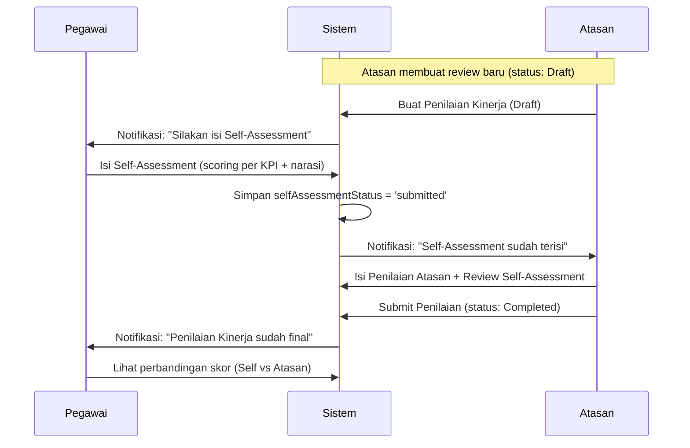

# PRD (Product Requirements Document) — Fitur Lanjutan Portal SDM

> **Portal SDM — HRMS Enhancement Roadmap**
> Versi: 1.0 | Tanggal: 7 Maret 2026
> Status: DRAFT — Menunggu Review

---

## Daftar Isi

1. [Latar Belakang](#1-latar-belakang)
2. [Ringkasan Fitur Lanjutan](#2-ringkasan-fitur-lanjutan)
3. [Fitur 1: SOP Formal per Modul](#3-fitur-1-sop-formal-per-modul)
4. [Fitur 2: Kebijakan Cuti & Payroll Sesuai Regulasi](#4-fitur-2-kebijakan-cuti--payroll-sesuai-regulasi)
5. [Fitur 3: Self-Assessment pada Penilaian Kinerja](#5-fitur-3-self-assessment-pada-penilaian-kinerja)
6. [Fitur 4: Struktur Organisasi (Org-Chart) Visual](#6-fitur-4-struktur-organisasi-org-chart-visual)
7. [Fitur 5: Stabilisasi Frontend TypeScript](#7-fitur-5-stabilisasi-frontend-typescript)
8. [Prioritas & Timeline](#8-prioritas--timeline)

---

## 1. Latar Belakang

Berdasarkan evaluasi HRMS yang dilakukan pada 7 Maret 2026 (lihat `evaluasi_hrms.md`), ditemukan bahwa Portal SDM sudah sangat layak sebagai sistem pengelolaan SDM profesional dengan skor **8.5/10** untuk manajemen kinerja dan **8/10** untuk kelayakan sebagai pedoman HR.

Namun, ada **5 area prioritas** yang perlu disempurnakan agar aplikasi ini dapat menjadi **standar penuh** bagi perusahaan:

| # | Area Penyempurnaan | Jenis |
|---|---|---|
| 1 | SOP Formal per Modul | 📄 Dokumentasi |
| 2 | Kebijakan Cuti & Payroll sesuai regulasi | 📄 Dokumentasi + 🔧 Kode |
| 3 | Self-Assessment di Penilaian Kinerja | 🔧 Kode (Frontend + Backend) |
| 4 | Struktur Organisasi Visual (Org-Chart) | 🔧 Kode (Frontend) |
| 5 | Stabilisasi Frontend TypeScript | 🔧 Kode (Frontend) |

---

## 2. Ringkasan Fitur Lanjutan

### Peta Fitur

```
📄 DOKUMENTASI                    🔧 IMPLEMENTASI KODE
─────────────────                 ────────────────────
[SOP Formal]                      [Self-Assessment]
  └── 10 dokumen SOP                └── Model: selfAssessment fields
      per modul HR                  └── Frontend: form + approval flow

[Kebijakan Cuti]                  [Org-Chart Visual]
  └── KEBIJAKAN_CUTI.md              └── Frontend page /dashboard/org-chart
  └── KEBIJAKAN_PAYROLL.md           └── Tree visualization + employee cards

                                  [Fix TypeScript]
                                    └── Resolve compilation errors
```

---

## 3. Fitur 1: SOP Formal per Modul

### 3.1 Tujuan
Menyediakan dokumen Standar Operasional Prosedur (SOP) untuk setiap modul HR agar proses kerja terdokumentasi secara formal dan dapat dijadikan kebijakan perusahaan.

### 3.2 Output
10 dokumen SOP di folder `docs/sop/`:

| File | Modul | Isi Utama |
|---|---|---|
| `SOP_01_MASTER_DATA_PEGAWAI.md` | Master Data | Alur CRUD pegawai, validasi, upload foto |
| `SOP_02_ABSENSI.md` | Absensi | Clock-in/out, toleransi keterlambatan, lembur |
| `SOP_03_CUTI.md` | Cuti & Izin | Jenis cuti, pengajuan, approval, saldo |
| `SOP_04_PENGGAJIAN.md` | Payroll | Komponen gaji, potongan, jadwal pembayaran |
| `SOP_05_KONTRAK.md` | Kontrak | Siklus kontrak, perpanjangan, terminasi |
| `SOP_06_KINERJA.md` | Penilaian Kinerja | KPI, self-assessment, scoring, coaching |
| `SOP_07_REKRUTMEN.md` | Rekrutmen | Posting lowongan, seleksi, onboarding |
| `SOP_08_PELATIHAN.md` | Pelatihan | Pendaftaran, sertifikasi, evaluasi |
| `SOP_09_LAPORAN.md` | Laporan | Jenis laporan, jadwal, distribusi |
| `SOP_10_NOTIFIKASI.md` | Notifikasi | Jenis reminder, channel, eskalasi |

### 3.3 Format Standar SOP
Setiap SOP mengikuti format:
1. **Tujuan** — Mengapa SOP ini ada
2. **Ruang Lingkup** — Siapa yang terlibat
3. **Definisi** — Istilah-istilah penting
4. **Prosedur** — Langkah demi langkah (dengan flowchart Mermaid)
5. **Ketentuan & Aturan** — Batasan dan kebijakan
6. **Formulir Terkait** — Referensi ke halaman aplikasi
7. **Riwayat Revisi** — Version history

---

## 4. Fitur 2: Kebijakan Cuti & Payroll Sesuai Regulasi

### 4.1 Tujuan
- Mendokumentasikan kebijakan cuti dan penggajian sesuai **UU Ketenagakerjaan No. 13 Tahun 2003** dan **PP No. 35 Tahun 2021**
- Memperbaiki kode backend agar jatah cuti **tidak hardcoded** tapi diambil dari `company_settings`

### 4.2 Dokumen Kebijakan

#### A. `KEBIJAKAN_CUTI.md`
| Aspek | Detail |
|---|---|
| Cuti Tahunan | Minimal 12 hari/tahun setelah 12 bulan kerja (UU 13/2003 Pasal 79) |
| Cuti Sakit | Sesuai diagnosa dokter, upah tetap dibayar (Pasal 93) |
| Cuti Melahirkan | 3 bulan (1.5 bulan sebelum + 1.5 bulan sesudah) (Pasal 82) |
| Cuti Besar | 2 bulan setelah 6 tahun kerja terus-menerus |
| Cuti Bersama | Ditentukan perusahaan, mengurangi saldo cuti tahunan |
| Carry-over | Kebijakan perusahaan (default: tidak carry-over) |
| Prorata | Untuk pegawai masuk di tengah tahun |

#### B. `KEBIJAKAN_PAYROLL.md`
| Aspek | Detail |
|---|---|
| Komponen Gaji | Gaji pokok, tunjangan tetap, tunjangan tidak tetap |
| Potongan Wajib | BPJS Kesehatan (1%), BPJS TK (2%), PPh 21 |
| Lembur | 1.5× upah/jam untuk jam pertama, 2× untuk jam selanjutnya (PP 35/2021) |
| Hari Pembayaran | Maksimal tanggal 1 bulan berikutnya |
| THR | 1 bulan gaji untuk masa kerja ≥12 bulan (prorata jika <12 bulan) |

### 4.3 Perbaikan Kode

#### Backend: `cuti.service.ts`
- **Saat ini:** `const jumlahJatahCuti = 18; // Hardcoded`
- **Perbaikan:** Ambil dari `company_settings.annualLeaveQuota`
- Tambahkan logika cuti `cutiBersama` dari tabel baru `cuti_bersama` (atau `company_settings`)

#### Backend: `company-settings.model.ts`
- Tambah field: `maternityLeaveQuota`, `bigLeaveQuota`, `carryOverPolicy`

---

## 5. Fitur 3: Self-Assessment pada Penilaian Kinerja

### 5.1 Tujuan
Memberikan kesempatan kepada pegawai untuk melakukan **penilaian diri sendiri** sebelum atasan memberikan penilaian resmi, sehingga proses evaluasi lebih adil dan transparan.

### 5.2 Status Saat Ini
- `HalamanKinerjaSaya.tsx` sudah memiliki fitur **umpan balik** (feedback) sederhana
- `penilaianKinerja.model.ts` sudah punya field `employeeFeedback`
- **Belum ada:** form self-scoring, self-KPI assessment, perbandingan skor atasan vs pegawai

### 5.3 Perubahan yang Diperlukan

#### A. Database (Migration)
Tambah kolom baru ke tabel `penilaian_kinerja`:

```sql
ALTER TABLE penilaian_kinerja ADD COLUMN selfAssessmentScore REAL DEFAULT NULL;
ALTER TABLE penilaian_kinerja ADD COLUMN selfAssessmentKpis TEXT DEFAULT NULL;
ALTER TABLE penilaian_kinerja ADD COLUMN selfAssessmentStrengths TEXT DEFAULT NULL;
ALTER TABLE penilaian_kinerja ADD COLUMN selfAssessmentAreas TEXT DEFAULT NULL;
ALTER TABLE penilaian_kinerja ADD COLUMN selfAssessmentDate TEXT DEFAULT NULL;
ALTER TABLE penilaian_kinerja ADD COLUMN selfAssessmentStatus TEXT DEFAULT 'belum_diisi' 
  CHECK(selfAssessmentStatus IN ('belum_diisi', 'draft', 'submitted'));
```

#### B. Backend
- **Model:** Tambah field self-assessment di `PenilaianKinerja` interface
- **Repository:** Tambah method `submitSelfAssessment(id, data)`
- **Service:** Tambah method `submitSelfAssessment` dengan validasi
- **Controller:** Tambah endpoint `PUT /api/kinerja/:id/self-assessment`
- **Routes:** Register endpoint baru

#### C. Frontend
- **`HalamanKinerjaSaya.tsx`:** Ganti textarea sederhana menjadi form self-assessment lengkap:
  - Self-scoring per KPI (skala 1-5)
  - Self-assessment kekuatan & area perbaikan
  - Tombol "Simpan Draft" dan "Kirim Self-Assessment"
- **`ManajemenKinerjaPage.tsx`:** Tampilkan badge jika pegawai sudah mengisi self-assessment
- **`FormKinerja.tsx`:** Tambah tab/section perbandingan skor atasan vs self-assessment

### 5.4 Alur Kerja Self-Assessment



### 5.5 UI Wireframe (Pegawai — Self-Assessment)

```
┌────────────────────────────────────────────────────┐
│ 📝 Self-Assessment — Periode 2026-S1               │
├────────────────────────────────────────────────────┤
│                                                    │
│ Penilaian KPI Diri Sendiri:                        │
│ ┌──────────────────────┬────────┬──────┬────────┐  │
│ │ KPI                  │ Target │ Skor │ Alasan │  │
│ ├──────────────────────┼────────┼──────┼────────┤  │
│ │ Akurasi Closing      │ 95%    │ [4▼] │ [____] │  │
│ │ Volume Transaksi     │ 200    │ [5▼] │ [____] │  │
│ │ Kecepatan Response   │ H+2    │ [3▼] │ [____] │  │
│ └──────────────────────┴────────┴──────┴────────┘  │
│                                                    │
│ Kekuatan Saya:                                     │
│ ┌────────────────────────────────────────────────┐  │
│ │ [textarea]                                     │  │
│ └────────────────────────────────────────────────┘  │
│                                                    │
│ Area yang Perlu Saya Tingkatkan:                   │
│ ┌────────────────────────────────────────────────┐  │
│ │ [textarea]                                     │  │
│ └────────────────────────────────────────────────┘  │
│                                                    │
│              [💾 Simpan Draft]  [📤 Kirim]         │
└────────────────────────────────────────────────────┘
```

---

## 6. Fitur 4: Struktur Organisasi (Org-Chart) Visual

### 6.1 Tujuan
Menampilkan **visualisasi struktur organisasi** secara hierarkis sehingga pegawai dan manajemen dapat melihat rantai komando, posisi, dan hubungan atasan-bawahan.

### 6.2 Status Saat Ini
- **Backend sudah lengkap:** 
  - `jabatan.repository.ts` memiliki `getTree()` dan `getTreeWithEmployees()`
  - `getSubordinates()` dan `getAllSubordinates()` sudah ada
  - Tabel `jabatan` punya field `parent_id`, `level`, `department`
  - Tabel `pegawai` punya `jabatan_id` dan `atasan_id`
- **Frontend belum ada:** Tidak ada halaman org-chart

### 6.3 Perubahan yang Diperlukan

#### Frontend Only (Backend sudah tersedia)

1. **Halaman Baru:** `OrgChartPage.tsx` di `features/pengaturan/pages/`
2. **Routing:** Tambah route `/dashboard/struktur-organisasi`
3. **Sidebar:** Tambah menu item "Struktur Organisasi"

### 6.4 Fitur Halaman Org-Chart

| Fitur | Deskripsi |
|---|---|
| **Tree View** | Tampilkan hierarki jabatan + pegawai sebagai tree yang bisa di-expand/collapse |
| **Card Node** | Setiap node menampilkan: nama jabatan, nama pegawai, foto, departemen |
| **Responsive** | Horizontal scroll untuk tree yang lebar |
| **Filter** | Filter by departemen |
| **Zoom** | Zoom in/out untuk tree besar |

### 6.5 UI Wireframe

```
┌─────────────────────────────────────────────────────────────┐
│ 🏢 Struktur Organisasi                   [Filter: Semua ▼] │
├─────────────────────────────────────────────────────────────┤
│                                                             │
│                    ┌─────────────┐                          │
│                    │ 👤 Direktur │                          │
│                    │ Nama: Budi  │                          │
│                    └──────┬──────┘                          │
│               ┌───────────┼───────────┐                    │
│          ┌────┴────┐ ┌────┴────┐ ┌────┴────┐              │
│          │ Kabag   │ │ Kabag   │ │ Kabag   │              │
│          │ Ops     │ │ Bisnis  │ │ IT/HR   │              │
│          └────┬────┘ └────┬────┘ └────┬────┘              │
│          ┌────┴────┐      │      ┌────┴────┐              │
│          │ Teller  │      │      │ IT      │              │
│          │ (3 org) │      │      │ (2 org) │              │
│          └─────────┘      │      └─────────┘              │
│                           │                               │
│                      ┌────┴────┐                          │
│                      │ Analis  │                          │
│                      │ (2 org) │                          │
│                      └─────────┘                          │
└─────────────────────────────────────────────────────────────┘
```

---

## 7. Fitur 5: Stabilisasi Frontend TypeScript

### 7.1 Tujuan
Menyelesaikan error kompilasi TypeScript di frontend agar production build berhasil tanpa error.

### 7.2 Status Saat Ini
- Frontend berjalan di development mode (Vite dev server) tanpa masalah
- Build production (`npx tsc --noEmit`) sebelumnya menunjukkan error (105 error di 39 file)
- **Catatan:** Banyak error sebelumnya sudah diperbaiki di conversation sebelumnya

### 7.3 Pendekatan
1. Jalankan `npx tsc --noEmit` untuk identifikasi error saat ini
2. Kategorisasi error: unused imports, type mismatch, missing methods
3. Perbaiki secara bertahap per kategori
4. Pastikan zero error di akhir

---

## 8. Prioritas & Timeline

| Prioritas | Fitur | Effort | Impact | Target |
|---|---|---|---|---|
| **P1** | Fitur 2: Kebijakan Cuti (perbaikan kode) | 1-2 jam | Tinggi — data cuti akurat | Hari 1 |
| **P2** | Fitur 3: Self-Assessment | 3-4 jam | Tinggi — standar profesional | Hari 1-2 |
| **P3** | Fitur 4: Org-Chart Visual | 2-3 jam | Sedang — visualisasi | Hari 2 |
| **P4** | Fitur 1: SOP Formal (3 SOP prioritas) | 2-3 jam | Sedang — dokumentasi | Hari 2-3 |
| **P5** | Fitur 5: Fix TypeScript | 1-2 jam | Rendah — stabilitas | Hari 3 |

### Urutan Implementasi

```
Hari 1:
  ✦ P1 — Perbaiki cuti.service.ts (gunakan company_settings)
  ✦ P1 — Buat KEBIJAKAN_CUTI.md dan KEBIJAKAN_PAYROLL.md
  ✦ P2 — Migrasi DB (kolom self-assessment)
  ✦ P2 — Backend endpoint self-assessment

Hari 2:
  ✦ P2 — Frontend form self-assessment
  ✦ P3 — Frontend halaman org-chart
  ✦ P4 — SOP Kinerja, SOP Cuti, SOP Payroll

Hari 3:
  ✦ P4 — SOP modul lainnya
  ✦ P5 — Fix TypeScript errors
  ✦ Testing & Review
```

---

## Lampiran: Referensi Regulasi

| Regulasi | Relevansi |
|---|---|
| UU No. 13/2003 tentang Ketenagakerjaan | Cuti, upah, jam kerja, PHK |
| PP No. 35/2021 tentang PKWT, Alih Daya, Waktu Kerja, dan PHK | Lembur, kontrak |
| PP No. 36/2021 tentang Pengupahan | Komponen gaji, upah minimum |
| UU No. 11/2020 tentang Cipta Kerja (Omnibus Law) | Perubahan ketentuan ketenagakerjaan |
| Permenaker No. 6/2016 tentang THR | Perhitungan THR |

---

*Dokumen ini adalah PRD (Product Requirements Document) yang berfungsi sebagai panduan pengembangan fitur lanjutan Portal SDM. Setiap fitur akan diimplementasikan secara bertahap sesuai prioritas.*
