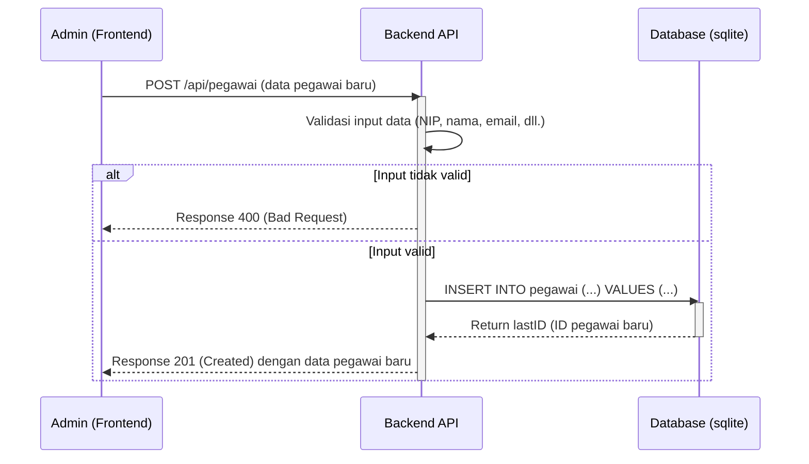
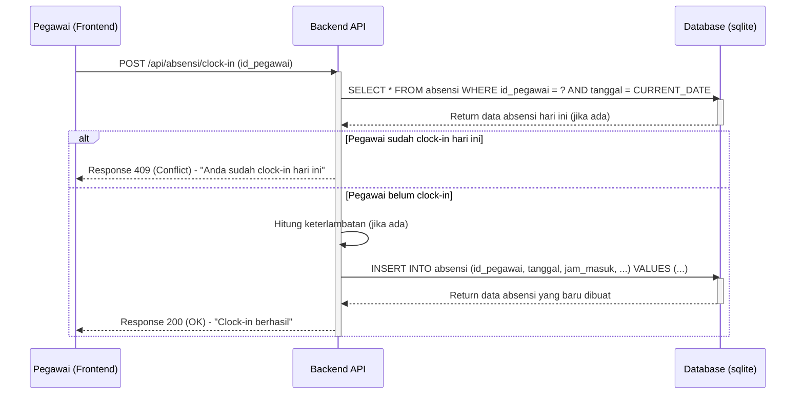
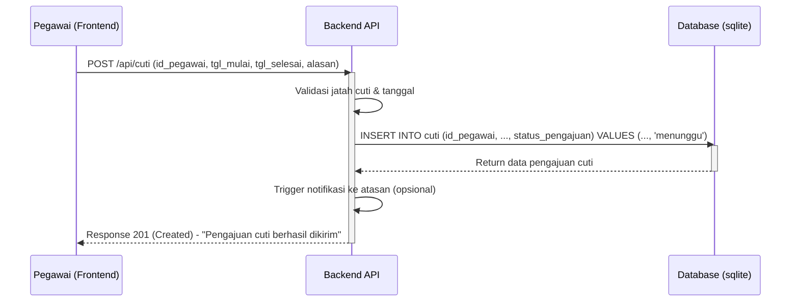
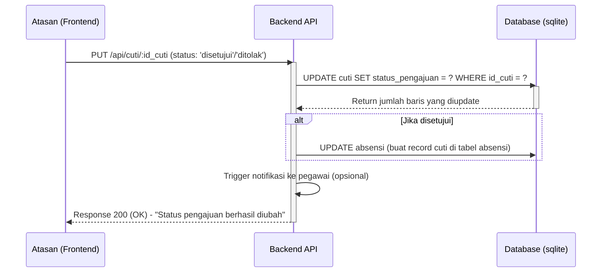

# Alur Kerja Aplikasi HRMS

Dokumen ini menjelaskan alur kerja utama (workflow) dari beberapa fitur kunci dalam aplikasi HRMS berdasarkan arsitektur yang ada.

## 1. Alur Kerja: Manajemen Pegawai (Admin)

Alur ini menjelaskan bagaimana seorang admin menambahkan data pegawai baru ke dalam sistem.



## 2. Alur Kerja: Absensi (Pegawai)

Alur ini menunjukkan proses saat seorang pegawai melakukan *clock-in*.



## 3. Alur Kerja: Pengajuan Cuti (Pegawai)

Alur ini menjelaskan bagaimana pegawai mengajukan cuti melalui sistem.



## 4. Alur Kerja: Persetujuan Cuti (Manajer/Atasan)

Alur ini menunjukkan bagaimana seorang atasan menyetujui atau menolak pengajuan cuti.



## 5. Alur Kerja: Proses Penggajian (Admin)

Alur ini menggambarkan proses kompleks saat admin menjalankan penggajian bulanan.

```mermaid
graph TD
    A[Admin klik "Jalankan Gaji" untuk Periode YYYY-MM] --> B{POST /api/penggajian/run};
    B --> C[Service Penggajian];
    C --> D{Ambil semua pegawai aktif};
    D --> E[Loop untuk setiap pegawai];
    E --> F{Hitung komponen gaji};
    F --> G[Ambil data absensi (kehadiran, lembur)];
    F --> H[Ambil data tunjangan];
    F --> I[Ambil data potongan (pinjaman, pajak)];
    G & H & I --> J{Kalkulasi Gaji Bersih};
    J --> K{Simpan hasil ke tabel `penggajian`};
    K --> E;
    E --> L[Selesai];
    L --> M{Response ke Admin: "Penggajian selesai"};
```
