# Database Documentation: Portal SDM v3

Dokumen ini mendokumentasikan skema database fisik SQLite (`database.sqlite`) berdasarkan keluaran literal perintah `.schema` dan analisis langsung terhadap kode backend di [apps/backend/db/](file:///opt/portal-sdmv3/apps/backend/db/).

---

## 💡 Mekanisme Migrasi & Gotcha Operasional

### 1. Masalah Idempotensi Migrasi (Risiko Data Loss)
* **Klaim vs Aktual**: Repositori memiliki tabel `_migrations` yang mencatat 20 entri migrasi lama (terakhir `20260325_phase1_foundation.sql`). Namun, skrip migrasi aktif saat ini ([migrate.ts](file:///opt/portal-sdmv3/apps/backend/db/migrate.ts)) **TIDAK menulis atau membaca** tabel `_migrations`.
* **Gotcha**: [migrate.ts](file:///opt/portal-sdmv3/apps/backend/db/migrate.ts) hanya melakukan pembacaan seluruh berkas `.sql` di direktori `migrations` secara berurutan lalu mengeksekusinya via `db.exec(sql)`. 
* **Dampak**: Karena beberapa berkas migrasi berisi perintah `ALTER TABLE` tanpa pengecekan kolom (`IF NOT EXISTS` tidak berlaku pada kolom di SQLite), menjalankan `npm run migrate` kedua kalinya pada database yang sudah terisi **akan crash** dengan error `duplicate column name` (misal pada `20260217_alter_penggajian.sql`). 
* **Satu-satunya Solusi Bawaan**: Melakukan reset database (`npm run reset`) yang akan menghapus seluruh tabel (Data Loss), kemudian menjalankan `npm run migrate` dari awal.

### 2. Migrasi Latar Belakang (Server Startup)
Ketika server backend dijalankan ([server.ts](file:///opt/portal-sdmv3/apps/backend/src/server.ts)), server akan otomatis menjalankan blok migrasi kecil secara dinamis untuk menambahkan kolom-kolom baru pada tabel `pengguna` dan `pegawai` secara langsung di memori, mengabaikan error duplikasi kolom secara aman.

---

## 🚨 TEMUAN ANOMALI SKEMA (Tabel & Kolom Tidak Terpakai)

Berdasarkan audit silang antara skema fisik SQLite dengan kode sumber backend, ditemukan beberapa tabel/kolom yang **dibuat secara fisik namun tidak pernah dipakai** untuk operasi bisnis di aplikasi:

1. **Tabel `pinjaman_karyawan`**: Dibuat di awal, tetapi tidak memiliki modul, controller, maupun repositori. Hanya dirujuk di [pegawai.repository.ts](file:///opt/portal-sdmv3/apps/backend/src/modules/pegawai/pegawai.repository.ts#L248) untuk proses penghapusan pegawai (*cascade delete*).
2. **Tabel `users`**: Dibuat berdampingan dengan tabel `pengguna`. Pengguna aktif, proses registrasi, dan login sepenuhnya menggunakan tabel `pengguna`. Tabel `users` hanya disentuh sekali saat proses pembersihan pegawai di [pegawai.repository.ts](file:///opt/portal-sdmv3/apps/backend/src/modules/pegawai/pegawai.repository.ts#L257).
3. **Tabel `organizational_kpi` & `department_kpi`**: Skema tabel didefinisikan secara fisik, tetapi **tidak ada satupun berkas kode backend** yang melakukan query, insert, maupun delete ke tabel-tabel ini.
4. **Tabel `daily_activities`**: Dibuat di awal untuk fitur KPI, tetapi pengisian aktivitas beban kerja harian dialihkan sepenuhnya ke tabel `log_aktivitas_harian`. Tabel ini hanya dirujuk untuk pembersihan data pegawai di repositori.
5. **Ketiadaan Database-level CHECK Constraint pada `role` di tabel `pengguna` [^3]**: Kolom `role` pada tabel `pengguna` hanya memiliki komentar dokumentatif `-- 'admin' atau 'employee'` tetapi tidak memiliki physical SQLite `CHECK(role IN ('admin', 'employee'))` constraint. Digabung dengan tidak adanya validasi API (`SEC-04`), hal ini membiarkan database dapat menerima string peran apa saja tanpa batasan struktural.

---

## 🔗 Peta Hubungan Relasi Tabel (Foreign Keys)

Berikut adalah visualisasi hubungan dependensi antar tabel di database (mana yang merujuk ke mana):

```mermaid
erDiagram
    pegawai ||--o| jabatan : "jabatan_id REFERENCES jabatan(id)"
    pegawai ||--o| pegawai : "atasan_id REFERENCES pegawai(id)"
    pengguna }|--|| pegawai : "employeeId REFERENCES pegawai(id)"
    permintaan_cuti }|--|| pegawai : "employeeId REFERENCES pegawai(id)"
    penggajian }|--|| pegawai : "employeeId REFERENCES pegawai(id)"
    penilaian_kinerja }|--|| pegawai : "employeeId REFERENCES pegawai(id)"
    kontrak }|--|| pegawai : "employeeId REFERENCES pegawai(id)"
    pelatihan }|--|| pegawai : "pegawai_id REFERENCES pegawai(id)"
    riwayat_jabatan }|--|| pegawai : "pegawai_id REFERENCES pegawai(id)"
    tugas_orientasi }|--|| pegawai : "employee_id REFERENCES pegawai(id)"
    notifications }|--|| pegawai : "employee_id REFERENCES pegawai(id)"
    data_change_requests }|--|| pegawai : "employeeId REFERENCES pegawai(id)"
    analisis_beban_kerja }|--|| pegawai : "employeeId REFERENCES pegawai(id) ON DELETE CASCADE"
    detail_beban_kerja }|--|| analisis_beban_kerja : "analysisId REFERENCES analisis_beban_kerja(id) ON DELETE CASCADE"
    kpi_targets }|--|| pegawai : "employeeId REFERENCES pegawai(id) ON DELETE CASCADE"
    log_aktivitas_harian }|--|| pegawai : "id_pegawai REFERENCES pegawai(id) ON DELETE CASCADE"
    log_aktivitas_harian }|--|| activity_library : "id_activity_library REFERENCES activity_library(id) ON DELETE CASCADE"
    assigned_tasks }|--|| pegawai : "supervisor_id REFERENCES pegawai(id) ON DELETE CASCADE"
    assigned_tasks }|--|| pegawai : "employee_id REFERENCES pegawai(id) ON DELETE CASCADE"
    integration_logs }|--o| api_keys : "api_key_id REFERENCES api_keys(id) ON DELETE SET NULL"
    kredit_berkas_tracking }|--|| kredit_berkas : "berkas_id REFERENCES kredit_berkas(id) ON DELETE CASCADE"
    wa_notification_log }|--|| kredit_berkas : "berkas_id REFERENCES kredit_berkas(id) ON DELETE CASCADE"
    daily_activities }|--|| pegawai : "id_pegawai REFERENCES pegawai(id) ON DELETE CASCADE"
    daily_activities }|--o| kpi_targets : "id_kpi_target REFERENCES kpi_targets(id) ON DELETE SET NULL"
    jabatan ||--o| jabatan : "parent_id REFERENCES jabatan(id) ON DELETE SET NULL"
    absensi }|--|| pegawai : "employeeId REFERENCES pegawai(id)"
```



---

## 📋 Skema Literal Database (Keluaran Literal `.schema`)

Berikut adalah hasil salinan literal dari `.schema` untuk seluruh tabel yang ditemukan pada database aktif `database.sqlite` per 11 Juli 2026:

### 1. Tabel Utama Pegawai & Struktur
```sql
CREATE TABLE pegawai (
    id TEXT PRIMARY KEY,
    name TEXT,
    nip TEXT UNIQUE,
    position TEXT,
    pangkat TEXT,
    golongan TEXT,
    department TEXT,
    joinDate TEXT,
    avatarUrl TEXT,
    jenis_kelamin TEXT,
    leaveBalance INTEGER,
    isActive INTEGER,
    address TEXT,
    phone TEXT,
    pob TEXT,
    dob TEXT,
    religion TEXT,
    maritalStatus TEXT,
    numberOfChildren INTEGER,
    educationHistory TEXT,
    workHistory TEXT,
    trainingCertificates TEXT,
    payrollInfo TEXT,
    email TEXT,
    statusKaryawan TEXT DEFAULT 'aktif',
    tanggalKeluar TEXT,
    createdAt DATETIME
, jabatan_id INTEGER REFERENCES jabatan(id), atasan_id TEXT REFERENCES pegawai(id));

CREATE TABLE jabatan (
  id INTEGER PRIMARY KEY AUTOINCREMENT,
  nama TEXT NOT NULL,
  level INTEGER NOT NULL DEFAULT 4,
  parent_id INTEGER,
  department TEXT,
  deskripsi TEXT,
  created_at DATETIME DEFAULT CURRENT_TIMESTAMP,
  FOREIGN KEY (parent_id) REFERENCES jabatan(id) ON DELETE SET NULL
);

CREATE TABLE riwayat_jabatan (
    id INTEGER PRIMARY KEY,
    pegawai_id TEXT,
    jabatan_lama TEXT,
    jabatan_baru TEXT,
    tanggal_perubahan TEXT,
    FOREIGN KEY (pegawai_id) REFERENCES pegawai(id)
);
```

### 2. Tabel Autentikasi & Akun
```sql
CREATE TABLE pengguna (
    id TEXT PRIMARY KEY,
    name TEXT,
    email TEXT UNIQUE,
    password TEXT,
    role TEXT, -- 'admin' atau 'employee'
    employeeId TEXT,
    createdAt DATETIME,
    FOREIGN KEY (employeeId) REFERENCES pegawai(id)
);

CREATE TABLE users (
    id INTEGER PRIMARY KEY,
    username TEXT,
    email TEXT,
    password TEXT,
    role TEXT,
    employeeId TEXT,
    avatarUrl TEXT,
    created_at DATETIME,
    FOREIGN KEY (employeeId) REFERENCES pegawai(nip)
);
```

### 3. Tabel Cuti & Kehadiran
```sql
CREATE TABLE permintaan_cuti (
    id TEXT PRIMARY KEY,
    employeeId TEXT,
    employeeName TEXT,
    leaveType TEXT,
    startDate TEXT,
    endDate TEXT,
    jumlahHari INTEGER NULL,
    reason TEXT,
    status TEXT DEFAULT 'menunggu',
    supportingDocument TEXT,
    rejectionReason TEXT,
    createdAt DATETIME DEFAULT CURRENT_TIMESTAMP,
    FOREIGN KEY (employeeId) REFERENCES pegawai(id)
);

CREATE TABLE absensi (
  id TEXT PRIMARY KEY,
  employeeId TEXT,
  employeeName TEXT,
  date TEXT,
  clockIn TEXT,
  clockOut TEXT,
  status TEXT DEFAULT 'hadir' CHECK(status IN ('hadir','izin','sakit','cuti','alpa','terlambat', 'tidak masuk')),
  workDuration TEXT,
  notes TEXT,
  created_at DATETIME DEFAULT CURRENT_TIMESTAMP,
  FOREIGN KEY(employeeId) REFERENCES pegawai(id)
);

CREATE TABLE holidays (
    id TEXT PRIMARY KEY, 
    tanggal TEXT NOT NULL UNIQUE, 
    deskripsi TEXT NOT NULL
);
```

### 4. Tabel Keuangan & Kontrak
```sql
CREATE TABLE penggajian (
    id TEXT PRIMARY KEY,
    employeeId TEXT,
    employeeName TEXT,
    period TEXT,
    baseSalary REAL,
    incomes TEXT, -- JSON
    deductions TEXT, -- JSON
    totalIncome REAL,
    totalDeductions REAL,
    netSalary REAL,
    tanggalPembayaran TEXT,
    createdAt DATETIME, status TEXT CHECK(status IN ('Draft', 'Final', 'Paid')) DEFAULT 'Draft', totalAttendance INTEGER DEFAULT 0, totalOvertime INTEGER DEFAULT 0, totalLateness INTEGER DEFAULT 0,
    FOREIGN KEY (employeeId) REFERENCES pegawai(id)
);

CREATE TABLE kontrak (
    id TEXT PRIMARY KEY,
    employeeId TEXT,
    contractNumber TEXT,
    contractType TEXT,
    startDate TEXT,
    endDate TEXT,
    status TEXT,
    contractFile TEXT,
    terms TEXT,
    salary REAL,
    notes TEXT,
    createdAt DATETIME,
    FOREIGN KEY (employeeId) REFERENCES pegawai(id)
);

CREATE TABLE pinjaman_karyawan (
    id_pinjaman INTEGER PRIMARY KEY,
    id_pegawai INTEGER,
    tanggal_pinjaman DATE,
    jumlah REAL,
    tenor INTEGER,
    cicilan_perbulan REAL,
    sisa_pinjaman REAL,
    status_pinjaman TEXT,
    created_at DATETIME,
    FOREIGN KEY (id_pegawai) REFERENCES pegawai(id)
);
```

### 5. Tabel Penilaian Kinerja & KPI
```sql
CREATE TABLE penilaian_kinerja (
    id TEXT PRIMARY KEY,
    employeeId TEXT,
    employeeName TEXT,
    period TEXT,
    reviewerName TEXT,
    reviewDate TEXT,
    overallScore REAL,
    status TEXT,
    strengths TEXT,
    areasForImprovement TEXT,
    employeeFeedback TEXT,
    kpis TEXT, -- JSON
    penilaiId TEXT,
    createdAt DATETIME, selfAssessmentDeadline TEXT DEFAULT NULL, selfAssessmentScore REAL DEFAULT NULL, selfAssessmentKpis TEXT DEFAULT NULL, selfAssessmentStrengths TEXT DEFAULT NULL, selfAssessmentAreas TEXT DEFAULT NULL, selfAssessmentDate TEXT DEFAULT NULL, selfAssessmentStatus TEXT DEFAULT 'belum_diisi',
    FOREIGN KEY (employeeId) REFERENCES pegawai(id)
);

CREATE TABLE kpi_templates (
    id TEXT PRIMARY KEY,
    department TEXT NOT NULL,
    kpiName TEXT NOT NULL,
    category TEXT NOT NULL DEFAULT 'outcome',    -- process | outcome | strategic
    targetValue REAL NOT NULL DEFAULT 0,
    targetUnit TEXT NOT NULL DEFAULT '%',
    weight REAL NOT NULL DEFAULT 0,
    description TEXT,                            -- penjelasan cara ukur
    measureSource TEXT,                          -- sumber data pengukuran
    periodType TEXT DEFAULT 'bulanan',           -- bulanan | kuartalan | semesteran | tahunan
    created_at DATETIME DEFAULT CURRENT_TIMESTAMP
);

CREATE TABLE kpi_targets (
    id TEXT PRIMARY KEY,
    employeeId TEXT NOT NULL,
    period TEXT NOT NULL,            -- Periode (YYYY-S1, YYYY-S2, YYYY)
    kpiName TEXT NOT NULL,           -- Nama KPI
    targetValue REAL NOT NULL DEFAULT 0,  -- Nilai target
    targetUnit TEXT,                 -- Satuan (%, hari, jumlah, menit)
    weight INTEGER NOT NULL DEFAULT 0,    -- Bobot (%)
    actualValue REAL DEFAULT 0,     -- Realisasi
    score REAL DEFAULT 0,           -- Skor otomatis (1-5)
    status TEXT CHECK(status IN ('active','completed','cancelled')) DEFAULT 'active',
    source TEXT CHECK(source IN ('abk','manual')) DEFAULT 'manual',
    abkActivityId TEXT,             -- Link ke activity_library (opsional)
    notes TEXT,
    created_at DATETIME DEFAULT CURRENT_TIMESTAMP,
    updated_at DATETIME DEFAULT CURRENT_TIMESTAMP, parentKpiId TEXT, evidenceUrl TEXT, category TEXT DEFAULT 'process', position TEXT, department TEXT,
    FOREIGN KEY (employeeId) REFERENCES pegawai(id) ON DELETE CASCADE
);

CREATE TABLE kpi_nominal_targets (
    id INTEGER PRIMARY KEY AUTOINCREMENT,
    employee_id TEXT NOT NULL,
    category TEXT NOT NULL CHECK(category IN ("npl", "kredit", "dana")),
    target_amount REAL NOT NULL DEFAULT 0,
    notes TEXT, updated_by TEXT,
    created_at DATETIME DEFAULT CURRENT_TIMESTAMP,
    updated_at DATETIME DEFAULT CURRENT_TIMESTAMP,
    UNIQUE(employee_id, category)
);

CREATE TABLE organizational_kpi (
    id TEXT PRIMARY KEY,
    year INTEGER NOT NULL,
    kpiName TEXT NOT NULL,
    targetValue REAL DEFAULT 0,
    targetUnit TEXT DEFAULT '%',
    weight REAL DEFAULT 0,
    actualValue REAL DEFAULT 0,
    score REAL DEFAULT 0,
    notes TEXT,
    created_at DATETIME DEFAULT CURRENT_TIMESTAMP,
    updated_at DATETIME DEFAULT CURRENT_TIMESTAMP
);

CREATE TABLE department_kpi (
    id TEXT PRIMARY KEY,
    orgKpiId TEXT,
    department TEXT NOT NULL,
    year INTEGER NOT NULL,
    kpiName TEXT NOT NULL,
    targetValue REAL DEFAULT 0,
    targetUnit TEXT DEFAULT '%',
    weight REAL DEFAULT 0,
    actualValue REAL DEFAULT 0,
    score REAL DEFAULT 0,
    notes TEXT,
    created_at DATETIME DEFAULT CURRENT_TIMESTAMP,
    updated_at DATETIME DEFAULT CURRENT_TIMESTAMP,
    FOREIGN KEY (orgKpiId) REFERENCES organizational_kpi(id) ON DELETE SET NULL
);
```

### 6. Tabel Analisis Beban Kerja (WLA)
```sql
CREATE TABLE analisis_beban_kerja (
    id TEXT PRIMARY KEY,
    employeeId TEXT NOT NULL,
    year INTEGER NOT NULL,
    position TEXT NOT NULL,
    department TEXT NOT NULL,
    totalYearlyMinutes INTEGER DEFAULT 0,
    status TEXT CHECK(status IN ('draft','submitted','approved','returned')) DEFAULT 'draft',
    created_at DATETIME DEFAULT CURRENT_TIMESTAMP,
    updated_at DATETIME DEFAULT CURRENT_TIMESTAMP,
    FOREIGN KEY (employeeId) REFERENCES pegawai(id) ON DELETE CASCADE
);

CREATE TABLE detail_beban_kerja (
    id TEXT PRIMARY KEY,
    analysisId TEXT NOT NULL,
    activityName TEXT NOT NULL,
    outputUnit TEXT, -- e.g. "Dokumen", "Nasabah", "Transaksi"
    durationMinutes INTEGER DEFAULT 0,
    freqDaily INTEGER DEFAULT 0,
    freqWeekly INTEGER DEFAULT 0,
    freqMonthly INTEGER DEFAULT 0,
    freqQuarterly INTEGER DEFAULT 0,
    freqSemester INTEGER DEFAULT 0,
    freqYearly INTEGER DEFAULT 0,
    totalMinutes INTEGER DEFAULT 0, activityId TEXT,
    FOREIGN KEY (analysisId) REFERENCES analisis_beban_kerja(id) ON DELETE CASCADE
);

CREATE TABLE activity_library (
    id TEXT PRIMARY KEY,
    position TEXT NOT NULL,          -- Jabatan (CS, Teller, HRD, etc.)
    department TEXT,                 -- Departemen
    activityName TEXT NOT NULL,      -- Nama aktivitas
    durationMinutes INTEGER NOT NULL DEFAULT 0, -- Durasi standar (menit)
    outputUnit TEXT,                 -- Satuan output (dokumen, nasabah, transaksi)
    category TEXT,                   -- Kategori (operasional, administrasi, lapangan)
    created_at DATETIME DEFAULT CURRENT_TIMESTAMP
, default_nominal INTEGER);

CREATE TABLE log_aktivitas_harian (
    id_log INTEGER PRIMARY KEY AUTOINCREMENT,
    id_pegawai TEXT NOT NULL,
    tanggal DATE NOT NULL,
    id_activity_library TEXT NOT NULL,
    frekuensi INTEGER NOT NULL DEFAULT 1,
    total_durasi_terhitung INTEGER NOT NULL DEFAULT 0,
    status_approval TEXT CHECK(status_approval IN ('pending', 'approved', 'rejected')) DEFAULT 'pending',
    catatan TEXT,
    created_at DATETIME DEFAULT CURRENT_TIMESTAMP,
    updated_at DATETIME DEFAULT CURRENT_TIMESTAMP, 
    lampiran TEXT, 
    nominal_rupiah REAL DEFAULT 0,
    FOREIGN KEY (id_pegawai) REFERENCES pegawai(id) ON DELETE CASCADE,
    FOREIGN KEY (id_activity_library) REFERENCES activity_library(id) ON DELETE CASCADE
);

CREATE TABLE daily_activities (
    id_daily_activity INTEGER PRIMARY KEY AUTOINCREMENT,
    id_pegawai TEXT NOT NULL, id_kpi_target TEXT,
    activityName TEXT NOT NULL, tanggal DATE NOT NULL,
    jam_mulai TIME, jam_selesai TIME, durasiMenit INTEGER,
    status TEXT CHECK(status IN ("pending","approved","rejected")) DEFAULT "pending",
    evidenceUrl TEXT, catatan TEXT,
    created_at DATETIME DEFAULT CURRENT_TIMESTAMP,
    updated_at DATETIME DEFAULT CURRENT_TIMESTAMP,
    FOREIGN KEY (id_pegawai) REFERENCES pegawai(id) ON DELETE CASCADE,
    FOREIGN KEY (id_kpi_target) REFERENCES kpi_targets(id) ON DELETE SET NULL
);
```

### 7. Tabel Kredit Berkas & Whatsapp Notifikasi
```sql
CREATE TABLE kredit_berkas (
    id INTEGER PRIMARY KEY AUTOINCREMENT,
    nomor_pengajuan TEXT NOT NULL,
    nama_pengajuan TEXT NOT NULL,
    jumlah_pengajuan REAL DEFAULT 0,
    jenis_kredit TEXT,
    current_stage TEXT NOT NULL DEFAULT "penerimaan",
    overall_status TEXT NOT NULL DEFAULT "dalam_proses",
    created_by TEXT NOT NULL,
    created_at DATETIME DEFAULT CURRENT_TIMESTAMP,
    updated_at DATETIME DEFAULT CURRENT_TIMESTAMP,
    catatan TEXT, no_wa_nasabah TEXT, nominal_persetujuan REAL,
    UNIQUE(nomor_pengajuan)
);

CREATE TABLE kredit_berkas_tracking (
    id INTEGER PRIMARY KEY AUTOINCREMENT,
    berkas_id INTEGER NOT NULL,
    stage TEXT NOT NULL,
    employee_id TEXT NOT NULL,
    employee_name TEXT, position TEXT,
    status_berkas TEXT NOT NULL DEFAULT "belum_lengkap",
    received_at DATETIME DEFAULT CURRENT_TIMESTAMP,
    completed_at DATETIME, catatan TEXT,
    FOREIGN KEY (berkas_id) REFERENCES kredit_berkas(id) ON DELETE CASCADE
);

CREATE TABLE wa_notification_log (
    id INTEGER PRIMARY KEY AUTOINCREMENT,
    berkas_id INTEGER NOT NULL,
    no_wa TEXT NOT NULL, nama_nasabah TEXT,
    trigger_stage TEXT NOT NULL, message_content TEXT NOT NULL,
    status TEXT NOT NULL DEFAULT "pending",
    provider_response TEXT, retry_count INTEGER DEFAULT 0,
    error_message TEXT, sent_at DATETIME,
    created_at DATETIME DEFAULT CURRENT_TIMESTAMP,
    FOREIGN KEY (berkas_id) REFERENCES kredit_berkas(id) ON DELETE CASCADE
);
```

### 8. Tabel Penugasan, Pelatihan & Dokumen
```sql
CREATE TABLE assigned_tasks (
    id TEXT PRIMARY KEY,
    supervisor_id TEXT NOT NULL,
    employee_id TEXT NOT NULL,
    task_name TEXT NOT NULL,
    description TEXT,
    status TEXT CHECK(status IN ('pending', 'completed', 'cancelled', 'approved')) DEFAULT 'pending',
    created_at DATETIME DEFAULT CURRENT_TIMESTAMP,
    updated_at DATETIME DEFAULT CURRENT_TIMESTAMP,
    FOREIGN KEY (supervisor_id) REFERENCES pegawai(id) ON DELETE CASCADE,
    FOREIGN KEY (employee_id) REFERENCES pegawai(id) ON DELETE CASCADE
);

CREATE TABLE tugas_orientasi (
    id INTEGER PRIMARY KEY,
    employee_id TEXT,
    task_name TEXT,
    description TEXT,
    due_date TEXT,
    completed INTEGER,
    FOREIGN KEY (employee_id) REFERENCES pegawai(id)
);

CREATE TABLE pelatihan (
    id INTEGER PRIMARY KEY,
    pegawai_id TEXT,
    nama_pelatihan TEXT,
    penyelenggara TEXT,
    tanggal_mulai TEXT,
    tanggal_selesai TEXT,
    nomor_sertifikat TEXT,
    FOREIGN KEY (pegawai_id) REFERENCES pegawai(id)
);

CREATE TABLE arsip_dokumen (
  id TEXT PRIMARY KEY,
  judul TEXT NOT NULL,
  kategori TEXT NOT NULL CHECK (kategori IN (
    'SK_DIREKSI', 'NOTULEN_RAPAT', 'NIB', 'SOP',
    'PERATURAN', 'PERJANJIAN', 'LEGALITAS', 'LAINNYA'
  )),
  nomorDokumen TEXT,
  tanggalTerbit TEXT,
  tanggalBerlaku TEXT,
  tanggalKadaluarsa TEXT,
  penerbit TEXT,
  deskripsi TEXT,
  filePath TEXT,
  ukuranFile INTEGER,
  tipeFile TEXT,
  tags TEXT DEFAULT '[]',
  status TEXT NOT NULL DEFAULT 'aktif' CHECK (status IN ('aktif', 'kadaluarsa', 'dicabut')),
  uploadedBy TEXT,
  createdAt TEXT NOT NULL,
  updatedAt TEXT NOT NULL
, tingkatKerahasiaan TEXT NOT NULL DEFAULT 'PUBLIK'
  CHECK (tingkatKerahasiaan IN ('PUBLIK', 'INTERNAL', 'RAHASIA', 'SANGAT_RAHASIA')));
```

### 9. Tabel Penunjang Aplikasi (System Tables)
```sql
CREATE TABLE company_settings (
  id INTEGER PRIMARY KEY AUTOINCREMENT,
  companyName TEXT,
  npwp TEXT,
  address TEXT,
  logo TEXT
, workStartTime TEXT DEFAULT '08:00', workEndTime TEXT DEFAULT '17:00', lateToleranceMinutes INTEGER DEFAULT 15, annualLeaveQuota INTEGER DEFAULT 12, sickLeaveQuota INTEGER DEFAULT 14, bankName TEXT DEFAULT '', bankAccountNumber TEXT DEFAULT '', payrollDate INTEGER DEFAULT 25, maternityLeaveQuota INTEGER DEFAULT 90, personalLeaveQuota INTEGER DEFAULT 3, carryOverPolicy TEXT DEFAULT 'none', probationMonths INTEGER DEFAULT 12, overtimeMultiplier REAL DEFAULT 1.5, thrPolicy TEXT DEFAULT 'prorata');

CREATE TABLE data_change_requests (
    id INTEGER PRIMARY KEY AUTOINCREMENT,
    employeeId TEXT NOT NULL,
    requestedChanges TEXT NOT NULL,
    status TEXT NOT NULL DEFAULT 'pending', -- pending, approved, rejected
    createdAt DATETIME DEFAULT CURRENT_TIMESTAMP,
    updatedAt DATETIME DEFAULT CURRENT_TIMESTAMP,
    reviewedBy TEXT, -- Admin user ID
    reviewNotes TEXT,
    FOREIGN KEY (employeeId) REFERENCES pegawai(id)
);

CREATE TABLE kandidat (
    id TEXT PRIMARY KEY,
    name TEXT NOT NULL,
    email TEXT NOT NULL,
    phone TEXT,
    position_applied TEXT,
    status TEXT DEFAULT 'baru' CHECK(status IN ('baru', 'diproses', 'diterima', 'ditolak')),
    resume_url TEXT,
    applied_date DATETIME DEFAULT CURRENT_TIMESTAMP,
    updated_at DATETIME DEFAULT CURRENT_TIMESTAMP
, cover_letter TEXT DEFAULT '', application_date TEXT DEFAULT '', notes TEXT DEFAULT '', created_at DATETIME DEFAULT CURRENT_TIMESTAMP);

CREATE TABLE notifications (
    id TEXT PRIMARY KEY,
    employee_id TEXT,
    message TEXT,
    type TEXT,
    is_read INTEGER,
    created_at DATETIME,
    scheduled_for DATETIME,
    delivery_channel TEXT,
    related_entity TEXT,
    related_entity_id TEXT,
    FOREIGN KEY (employee_id) REFERENCES pegawai(id)
);

CREATE TABLE api_keys (
    id INTEGER PRIMARY KEY AUTOINCREMENT,
    name TEXT NOT NULL,         -- e.g., 'Sistem Keuangan', 'HRIS Pusat'
    key_hash TEXT NOT NULL,     -- The hashed API key for security
    status TEXT CHECK(status IN ('aktif', 'nonaktif')) DEFAULT 'aktif',
    created_at DATETIME DEFAULT CURRENT_TIMESTAMP
);

CREATE TABLE integration_logs (
    id INTEGER PRIMARY KEY AUTOINCREMENT,
    api_key_id INTEGER,         -- Optional, null if request failed authentication
    endpoint TEXT NOT NULL,
    method TEXT NOT NULL,
    status_code INTEGER NOT NULL,
    response_time_ms INTEGER NOT NULL,
    error_message TEXT,
    created_at DATETIME DEFAULT CURRENT_TIMESTAMP,
    FOREIGN KEY (api_key_id) REFERENCES api_keys(id) ON DELETE SET NULL
);

CREATE TABLE audit_logs (
    id INTEGER PRIMARY KEY AUTOINCREMENT,
    user_id TEXT NOT NULL,
    action TEXT NOT NULL,
    module TEXT NOT NULL,
    description TEXT NOT NULL,
    metadata TEXT DEFAULT '{}',
    request_id TEXT,
    created_at TEXT DEFAULT CURRENT_TIMESTAMP
, device TEXT);

CREATE TABLE release_changelog (
    id INTEGER PRIMARY KEY AUTOINCREMENT,
    release_tag TEXT NOT NULL,
    module TEXT NOT NULL,
    type TEXT NOT NULL,
    description TEXT NOT NULL,
    impacted_files TEXT DEFAULT '[]',
    created_by TEXT DEFAULT 'system',
    released_at TEXT DEFAULT CURRENT_TIMESTAMP
);

CREATE TABLE _migrations (
    id INTEGER PRIMARY KEY AUTOINCREMENT,
    filename TEXT UNIQUE NOT NULL,
    applied_at DATETIME DEFAULT CURRENT_TIMESTAMP
);
```

---

## 📝 Catatan Kaki (Footnotes - Verifikasi Dokumen Lama)

[^1]: **KLAIM KONTRAKTIF**: Dokumen [AGENTS.md](file:///opt/portal-sdmv3/AGENTS.md) mengklaim bahwa *"migrations only"* digunakan dan *"NEVER copy your local database.sqlite over the Docker volume"*. Namun, aktualnya [migrate.ts](file:///opt/portal-sdmv3/apps/backend/db/migrate.ts) tidak memiliki *state tracking* migrasi yang andal. Menjalankannya kembali pada DB yang sudah terisi akan langsung memicu crash, memaksa dilakukannya reset total (Data Loss) untuk memulihkan keadaan awal. Hal ini terbukti bertentangan dengan prinsip ketahanan data produksi yang stabil.

[^2]: **ANOMALI CODEBASE**: Tabel `users` dibuat secara fisik dan mereferensikan `pegawai(nip)`. Namun, seluruh operasi login aplikasi dan data relasi akun dikerjakan melalui tabel `pengguna` yang merujuk ke `pegawai(id)`. Tabel `users` hanya terikat secara redundan di query penghapusan pegawai cascade.

[^3]: **MISSING DB-LEVEL CONSTRAINT**: Kolom `role` pada tabel `pengguna` tidak diamankan secara struktural di tingkat mesin database SQLite (tidak ada `CHECK` constraint). Ini mempermudah eksploitasi jika validasi lapisan aplikasi (API) dilewati atau tidak ada.
